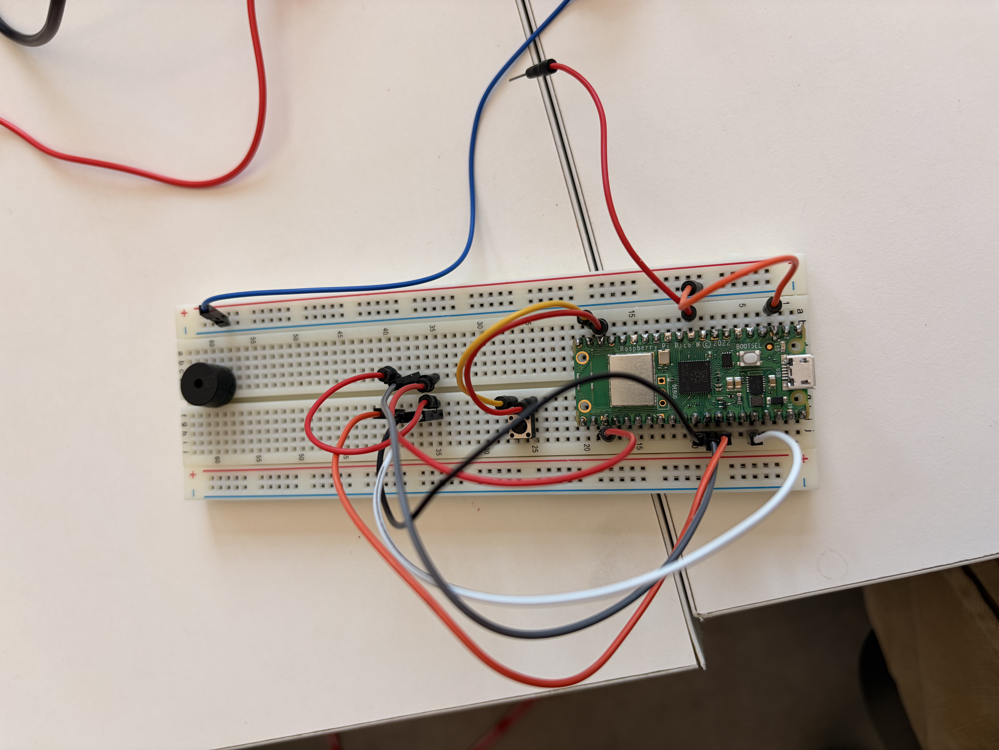
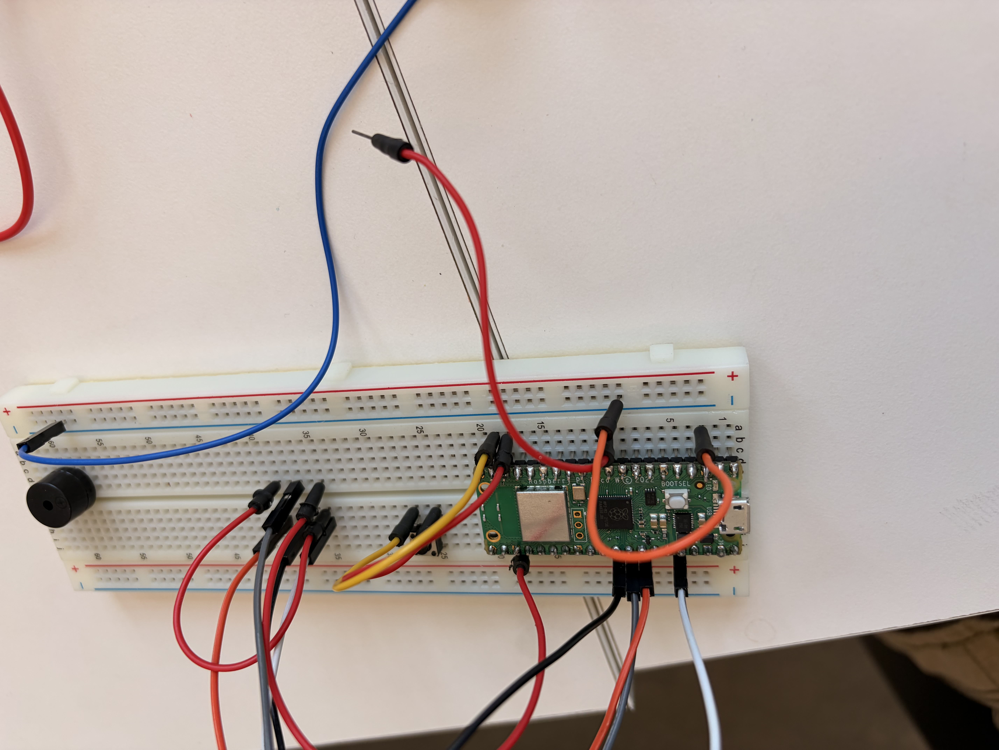

[<](README.md)

# DevLog 05

## Outcomes 

<!-- 
Using the backslash preserves the list number 
https://stackoverflow.com/a/50916345/441878 
-->

1\. 📚Read Chapter 5 (58-67) Physical Computing with Pico. Post documentation of your Traffic light controller

Done in class, showed Dr. Mundy.

2\. 📚Read Chapter 6 (68-79) Physical Computing with Pico. Post documentation of your Reaction Game

Done in class.

3\. Post documentation showing data from an analog sensor.

See video of musical instrument with data streamed to computer.
https://youtube.com/shorts/XYslZ12iYtQ

4\. 📚Read Brian Merchant [Everything That’s Inside Your iPhone](https://www.vice.com/en/article/everything-thats-inside-your-iphone/) Motherboard (2017). ✏️ Write a reflection below:

Reading this piece helped me see beyond the veneer of the iPhone’s sleek image. It helped me recognise the vast supply chains and patterns of extraction that make its existence possible. The contrast between cutting-edge technology and the dangerous, sometimes exploitative conditions faced by miners is unsettling and hard to ignore. It challenges us to see beyond the convenience offered to us by modern products and see the exploitation it took to deliver it. I was especially struck by how little of the phone’s value comes from its raw materials, despite the enormous effort required to obtain them.

5\. 📚Read Chapter 7 (80-91) Physical Computing with Pico. Post documentation of your Burglar Alarm.

Done in class.

6\. 📚Read Chapter 8 (92-103 ) Physical Computing with Pico. Post documentation of your Temperature gauge.

Done in class.

7\. Post documentation showing audio from your Pico

https://youtu.be/7iM7FUXrSN8

8\. Post documentation showing audio from your Pico

https://youtube.com/shorts/XYslZ12iYtQ

9\. Post documentation of your progress on the Musical Instrument

10\. Post documentation of your progress on the Musical Instrument

## Other experiments

<!-- 
Share details about other electronic experiments you are working on this week?
-->

- 

## Questions to bring up in class

<!-- 
Share questions you would like to bring up in class.
-->

- 
