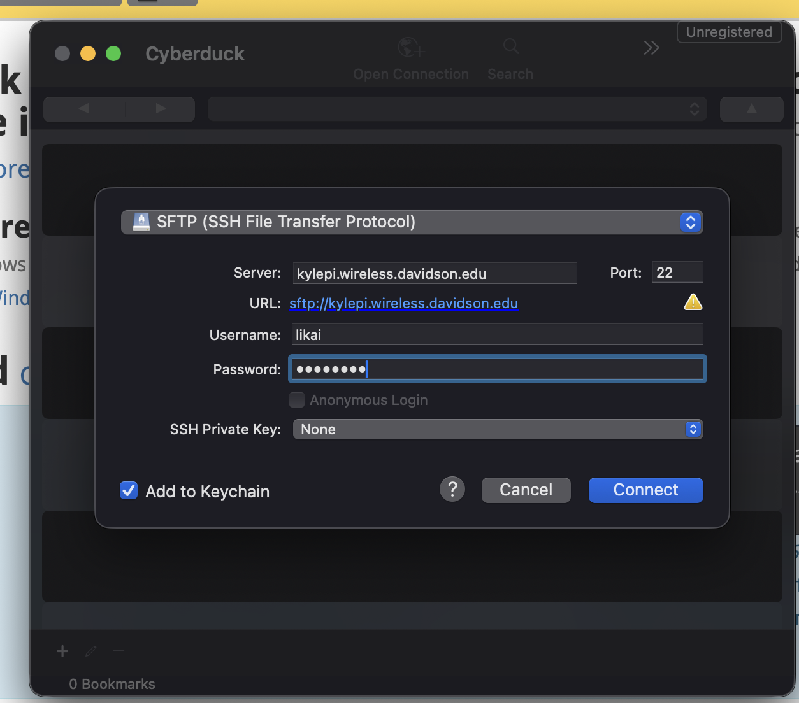

[<](README.md)

# DevLog 07

> Use git, python, and GPIO connections to turn on LEDs, read sensors

## Outcomes 

<!-- 
Using the backslash preserves the list number 
https://stackoverflow.com/a/50916345/441878 
-->

1\. Turn `on` and `off` an LED using the command line, GPIO and python. ✏️

https://youtu.be/xlTPXRFnG48

2\. Clone a repo to your Raspberry Pi over SSH ✏️ 

https://github.com/hzeller/rpi-rgb-led-matrix

3\. Run a python script in the repository

4\. Read a button (connected to a pulldown resistor) with your RPi and use the value to control an LED. ✏️

https://youtu.be/RnTRupddfDU

5\. Connect to your Pi over SFTP and upload / download files ✏️

6\. Fade an LED using PWM from your Pi ✏️ 

https://youtu.be/IIzHIs5HDHM

7\. Read values from a photoresistor with your Pi ✏️ 

Done in class

8\. Explore sensors in class. List two analogs and two digital sensors ✏️ 

1. Temperature sensor
2. Photoresistor
3. Distance sensor
4. Motion sensor

9\. Use a relay to safely control a higher power voltage with your Pi ✏️ 

Done in class

10\. Link to your final project pitch ✏️ 

https://docs.google.com/presentation/d/1rur4jZ9Eb_dvRqSIqiW5fMj_cHbsJCbyqqdRq8aCZ64/edit?usp=sharing

## Other experiments

<!-- 
Share other electronic experiments from this week?
-->

- 

## Questions to bring up in class

<!-- 
Share questions you would like to bring up in class.
-->

- 
